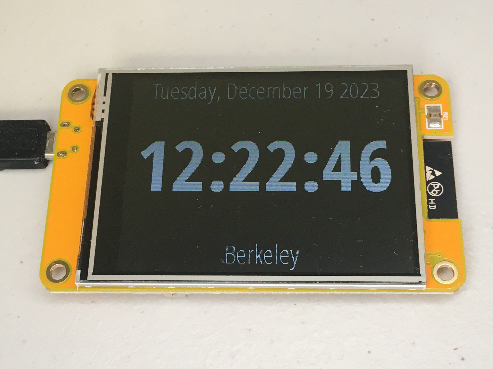

# ESP32-2432S028 Internet Synced (NTP) Clock

  

## Introduction

I wanted an NTP clock with time zones and automatic daylight savings time.  I found ESP32-2432S028 with a TFT display.  You can buy it for under $10 in China, but I paid under $20 in the US so I wouldn't have to wait for shipping.

## Build

These instructions have been tested with Ubuntu 22.04.3, Windows 10 and Arduino IDE 2.0.2-2.1.1.

- [Ubuntu only] **Remove** brltty, an app for blind people, which interferes with ESP32-2432S028.

    `sudo apt purge brltty`

- [Ubuntu only] **Install** pyserial which is required by Arduino IDE

    `pip install pyserial`

- **Start Arduino IDE**
- **Select Board**

    Board is `ESP32 Dev Module`

    Port is `/dev/ttyUSB0` [Ubuntu]

    Port is `COM??` [Windows]

    IDE will ask if you want to install esp32 core.  The name has changed so you may have to select `ESP32 Dev Board` and later change to `ESP32 Dev Module`.

- **Install libraries** · Use `Manage Libraries...` to install `LovyanGFX(1.1.9)` and `lvgl(8.3.11)` libraries.
- **Clone repository**

    `cd ~/Arduino/`

    `git clone https://github.com/alannishioka/esp32-2432s028-clock.git`

- **Copy** `lv_conf.h` to `~/Arduino/libraries/`. This assumes `lvgl` library is in `~/Arduino/libraries/lvgl/`.
- **Edit** `config.h` to input your WiFi ssid/password.

- **Connect** ESP32-2432S028 to your computer with micro USB cable.

- **Build and Install** using Arduino IDE

## Notes

- Fonts were converted with [LVGL Online Font Convertor](https://lvgl.io/tools/fontconverter)
I used condensed because display is taller than it needs to be and so date would fit on a single line.
- Schematic [page 1](img/schematic1.jpg), [page 2](img/schematic2.jpg)

## Thank you

- This project is a fork of https://github.com/cjgb/esp32-2432s028-meteo
I feel it is fastest to get a project working by starting with something that already works!
- [NTP with Day Light Saving Time for the ESP32](https://werner.rothschopf.net/microcontroller/202103_arduino_esp32_ntp_en.htm) also explains how to change the NTP update interval.
- [Sunton ESP32 2.8 inch 240*320 TFT with Touch](https://wiki.makerfabs.com/Sunton_ESP32_2.8_inch_240x320_TFT_with_Touch.html) describes board and software resources

